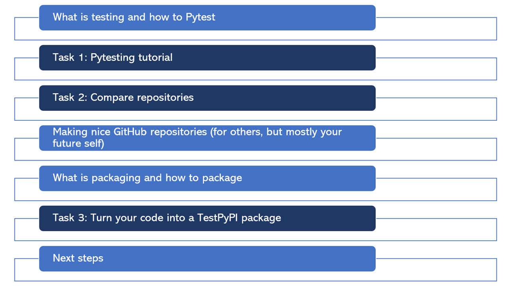

# Tutorial for Pytesting and PyPI

Basic tutorial for testing and packaging Python code. Read below on how to work with this repository.


Check out these slides for more information (click on the image below to view the slides):
[](documents/testing_and_packaging_slides.pdf)

## Getting Started

To clone this repository:

- Open Git Bash, your Command Prompt or Powershell
- Navigate to the directory where you want to clone this repository: cd/path/to/directory
- Run git clone command: `git clone https://github.com/ZoeHancox/pytesting_and_pypi_tutorial.git`

---

To create a suitable environment we suggest using Anaconda:

- Build conda environment: `conda create --name tut_env python=3.8`
- Activate environment: `conda activate tut_env`
- Change to your current working directory: `cd path\to\pytesting_and_pypi_tutorial`
- Install requirements: `pip install -r ./requirements.txt`


## Pytest Practice

Once you've cloned the repository and set up your IDE as desired, head to `pytest_tutorial/pytesting.ipynb` and work through this notebook.

## TestPyPI Practice

Once you've completed the `pytesting.ipynb` notebook work through the steps below to create your very own `passgen` TestPyPI package.

1. Create your account

- [ ] Create a TestPyPI account [here](https://test.pypi.org/account/register/).

- [ ] Get an API token on TestPyPI (Account Settings -> Add API Token). _You can name your token how you like_.

- [ ] Rename the `passgen` folder to `passgen_yourname`.

- [ ] Rename the `name="passgen",` in `setup.py` to `name="passgen_yourname"`.

2. Build your package

- [ ] To build your package in Anaconda with your tut_env environment activated type:
    ```
    conda activate tut_env
    pip install --upgrade build
    pip install setuptools wheel twine
    python setup.py sdist bdist_wheel
    ```


2. Test your code locally (optional)

- [ ] In your Anaconda window type:

    ```
    conda deactivate tut_env
    conda create --name test_local python=3.8
    conda activate test_local
    cd path\to\your\pytesting_and_pypi_tutorial_repo
    pip install dist/passgen_yourname-0.0.1-py3-none-any.whl
    pip list # You should see you package in this list
    ```

    ```
    python

    from passgen_yourname.generate_pass import generate_password

    generate_password(10)
    ```


3. Upload your package to TestPyPI

- [ ] In your command window type:

        ```
        set TWINE_USERNAME=__token__
        set TWINE_PASSWORD=your_api_token_value_here
        twine upload --repository-url https://test.pypi.org/legacy/ dist/*

        ```

> [!NOTE] 
> Sometimes when uploading your dist it will say the version already exist, so use `twine upload --repository-url https://test.pypi.org/legacy/ --skip-existing dist/*` instead.


- [ ] You should be able to find your package here: test.pypi.org/project/passgen_yourname/

4. Install your TestPyPI package 

- [ ] Create a new Python environment in a new Anaconda window:

    ```
    conda create --name test_package_env python=3.8
    conda activate test_package_env
    ```

- [ ] Install your package:

    Because TestPyPI is a bit more buggy than PyPI you might need to install some packages first:
    `pip install ipykernel numpy` 

    `pip install --index-url https://test.pypi.org/simple/ your-package-name`

> [!IMPORTANT] 
> Make sure to include the SPACE between simple/ and you-package-name


    

5. Test your TestPyPI package

    ```
    python

    from passgen_yourname.generate_pass import generate_password

    generate_password(10)
    ```


### Here are some resources I found helpful:

[Writing README.md files](https://www.makeareadme.com/)

[Getting started with writing and formatting on github](https://docs.github.com/en/get-started/writing-on-github/getting-started-with-writing-and-formatting-on-github/basic-writing-and-formatting-syntax)

[Adding a workflow status badge](https://docs.github.com/en/actions/monitoring-and-troubleshooting-workflows/adding-a-workflow-status-badge 
)

[Turning your repository into a package](https://www.youtube.com/watch?v=Kz6IlDCyOUY&ab_channel=pixegamihttps://packaging.python.org/en/latest/tutorials/packaging-projects/)